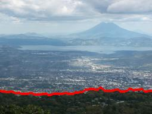
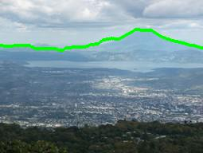

## **Horizon Finding**

A classic problem in computer vision is to identify where on Earth a photo was taken using visual features alone (e.g., not using GPS). One way of trying to geolocate such photos is by extracting the horizon (the boundary between the sky and the mountains) and using this as a fingerprint that can be matched with a digital elevation map to identify where the photo was taken.

#### A description of how you formulated each problem:

This problem has 3 sub parts to work on. The initial code given, loads the image, calculates the edge strength map and draws a straight line in the middle of the image. Based on the formula and the explanation given in the instruction, the first part of the problem was solved using the <i>argmax</i> function of NumPy which gets the maximum edge strength from each column and returns a row. While this was a simple and a one liner solution, the results were pretty bad. Thus, we move on to the next part of the problem where we are suggested to use Hidden Markov Model and use Viterbi algorithm to solve the Maximum a Posterior estimate. For Viterbi we require 3 elements: state probabilities, transition probabilities and emission probabilities. Now mountains are not straight, so it is important to detect whether the ridge is moving upwards or downwards. What we’ve done is that while traversing through the columns, we take 5 pixels of the next column (one in the same row, and 2 above and below this pixel) and check for the state which has the maximum probability. Transition probabilities are assigned logically based based on these 5 pixels.We expect the ridge to mostly go forward or a pixel above or below as we go from column to column . The one beside the current state gets the highest probability, the states one above and below this state are assigned a lower probability and the states two above and below the state are assigned the least probabilities. Implementing this logic with Viterbi algorithm did produced results better than the previous part however, but only for the images in which the horizon was clear. Hence, to solve this issue we move to the third part of the problem where we give human input in the form of coordinates, i.e. a point on the ridge. As the instruction suggested that we do not change the implementation of the algorithm, we can just feed the input in our implementation. What we’ve done for this part is that once we get the human input, we get the maximum states from each column in both directions from the given column. This implementation provided the best results in detecting the horizon.

#### A brief description of how your program works:

As the problem is divided in 3 parts our implementation of the code has also 3 parts The first part, as discussed above uses argmax function of the NumPy library to find the maximum edge strength from each column and returns a row. The program for the second part involves Hidden Markov Model solved using the Viterbi algorithm. The code traverses through each column and checks 5 consecutive states in the next column to find the next most probable state. This is done by calculating the max of 5 products of previous state probabilities into the transition probabilities from the previous state to the current state. Our code works in a dynamic programming way where we store the maximum row number of the previous column so we can use it as a lookup table when we back track.The program for the third part is similar to the previous part with additional input from the human. The user gives a coordinate on the ridge which is fed into the Viterbi algorithm and performs a bidirectional search from the given column to find the most probable states and return a row. The human input works with the ripple effect as the probabilities propagate through the pixels and we can see a much better output accuracy. While factoring in the human input, we set the value of the particular pixel as 1 probability and 0 for other states in that column.

#### Discussion of any problems you faced, any assumptions, simplifications, and/or design decisions you made:

One of the main design decisions we had to make was to decide the transition probabilities as the instructions mentioned that there are no right answers for that. Hence, we logically decided that when going from column to other the ridge will only move a pixel above, below(probability 0.2545) or stay in the same row with the highest chance it stays of 0.5. We gave a minute chance for the ridge to skip a pixel and jump to two rows above or below the current row when going from column to column(0.005). We assumed that the transition probabilities from far away states is 0 since ridge jumping should not happen. After handling the transition probabilities we needed starting probabilities of each row, which we assumed to be the edge strength for that pixel divided by the total edge strength of the column as to main the sum or entire column as 1. We tried a couple of possible solutions here as giving equal starting probabilities to each pixel in the column (1/number of rows) or just the edge strength but found this works the best. We assumed emission probabilities as the edge strength values for each pixel. We did not divide it with total edge strength of the column this time since all we needed the values were for comparing and the denominator could be ignored since it would be constant among all the probabilities that would be compared. This avoided the underflow error we would have gotten if we divided it with a huge number. To avoid the overflow error now we divided the emission probabilities with 100. In the Human input, we initially tried only moving the effect forwards since it was intuitive but when we moved the effect backward too, the ridge was much more accurate. 

### The example outputs:
#### Using Bayes Net:

#### Using Viterbi:

#### Adding Human Feedback of (row=48, col=142) to Viterbi:

